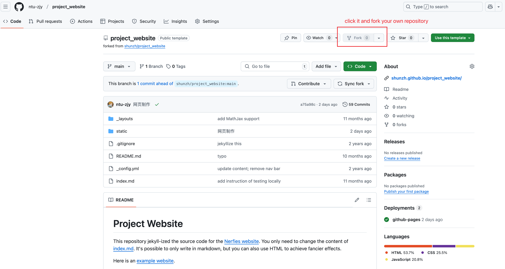
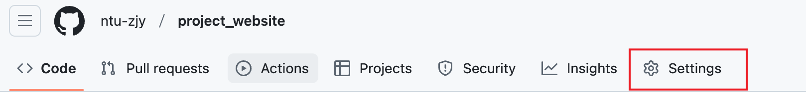
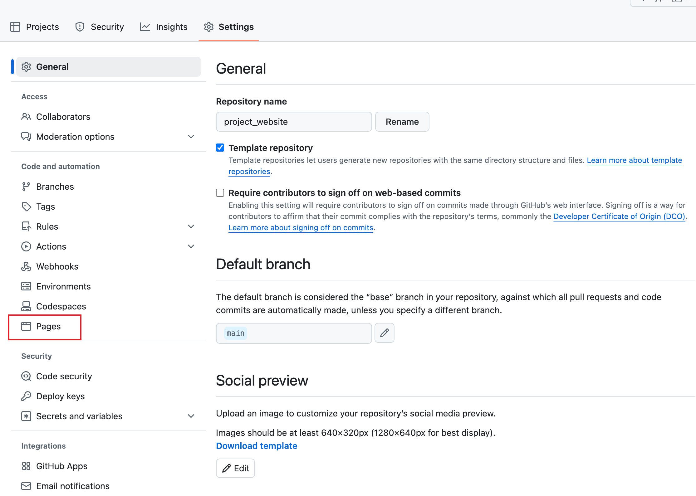
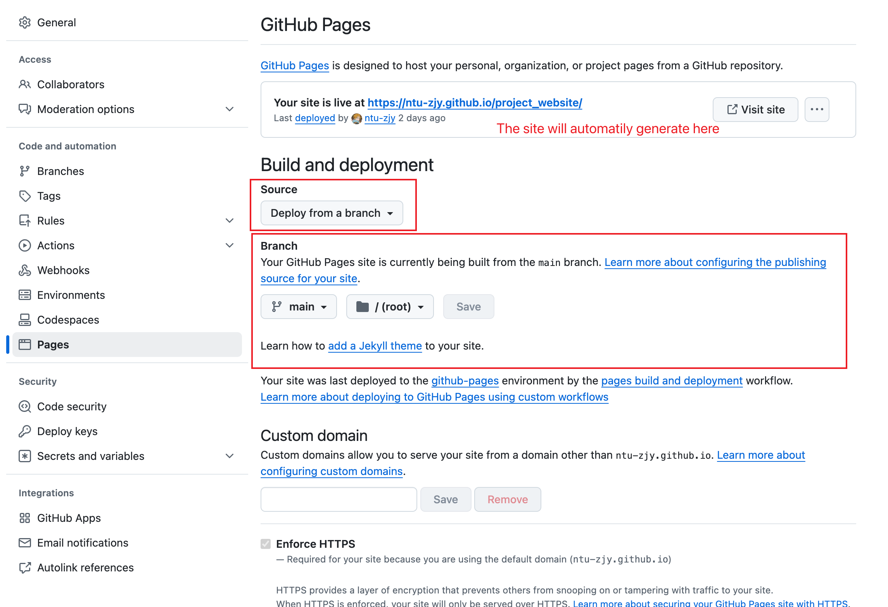

# Project Website

This repository jekyll-ized the source code for the [Nerfies website](https://nerfies.github.io).
You only need to change the content of [index.md](/index.md).
It's possible to only write in markdown, but you can also use HTML to achieve fancier effects.

Here is an [example website](https://shunzh.github.io/project_website/).

## Run it on github pages (recommend)

Step1: fork this repository



Step2: Deploy



---



----



Then, finish!

## Test it locally

Install [Jekyll](https://jekyllrb.com/docs/installation/), and run

```
jekyll serve
```

in this directory.
Then you can see the website at `http://127.0.0.1:4000`.
